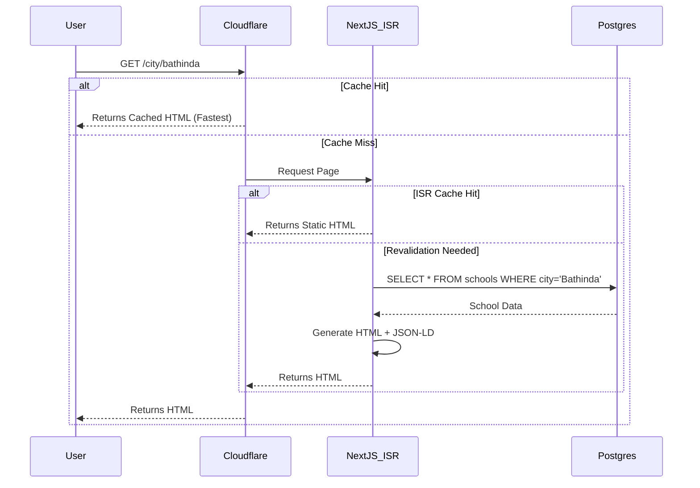
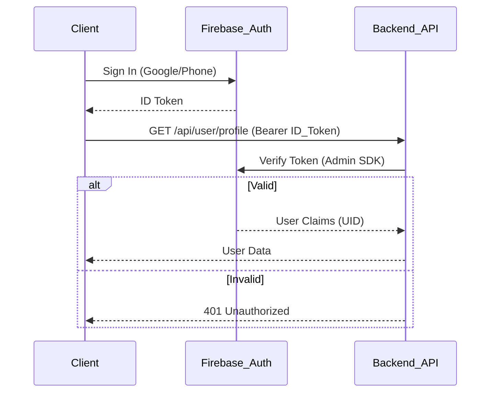

# System Architecture: GetSchoolInfo

## 1. High-Level Overview
GetSchoolInfo is a scalable, hybrid-architecture platform designed to serve millions of school discovery queries with high performance and minimal cost. It leverages **Next.js (App Router)** for a high-performance frontend with Programmatic SEO, backed by **PostgreSQL** for structured data and **Firebase** for user authentication and engagement.

### Core Stack
*   **Frontend**: Next.js 14+ (React 18), TypeScript, Tailwind CSS.
*   **Backend**: Node.js (Express), Firebase Admin SDK.
*   **Database**: PostgreSQL (Relational Data), Firebase (User/Lead Data).
*   **Infrastructure**: Docker, Nginx/Cloudflare (Edge).

---

## 2. Component Architecture

### A. Frontend Layer (Next.js)
The frontend is the critical layer for SEO and User Experience.
*   **App Router**: Uses server-side routing for optimal initial load time.
*   **Programmatic SEO Engine**:
    *   **Dynamic Routes**: `/city/[city]`, `/board/[board]`, `/type/[type]` handle thousands of landing pages without creating manual files.
    *   **Incremental Static Regeneration (ISR)**: Critical for cost savings. Pages like `/city/bathinda` are pre-built at build time or lazily built once and cached for 24 hours (`revalidate = 86400`). This ensures zero DB hits for read traffic.
    *   **Metadata API**: Dynamic `generateMetadata` injects unique Titles, Descriptions, and OpenGraph images for every single school and category page.
*   **Client vs. Server Components**:
    *   `page.tsx`: **Server Component**. Fetches data (Directly from DB or API), generates Metadata, renders JSON-LD.
    *   `SchoolList.tsx`, `SchoolDetailClient.tsx`: **Client Components**. Handle interactivity (Filters, Maps, Modals).

### B. Security & Edge Layer
*   **Cloudflare**: Acts as the entry point.
    *   **DDoS Protection**: Shields the origin server.
    *   **Caching**: Caches HTML responses from ISR pages.
    *   **SSL**: Full Strict SSL termination.
*   **Middleware (`middleware.ts`)**: Next.js Edge Middleware.
    *   **Bot Protection**: Blocks aggressive scrapers (Python-requests, Curl) while allowing AI Bots (GPTBot, Googlebot).
    *   **Rate Limiting**: Token bucket algorithm to prevent abuse (e.g., 100 req/min per IP).
    *   **Security Headers**: Adds `X-XSS-Protection`, `X-Content-Type-Options`, `X-Frame-Options`.

### C. Infrastructure Security (Firewall & Ports)
*   **Principle of Least Privilege**: Only essential ports are open to the world.
    *   **Public Ports**: `80` (HTTP), `443` (HTTPS), `22` (SSH - restricted to Admin IP).
    *   **Internal Only**:
        *   `5432` (Postgres): Not exposed to host network in Production (`127.0.0.1:5432` or Docker Network only).
        *   `5001` (Backend API): Reverse Proxied via Nginx/Docker, not directly exposed.
*   **Firewall (UFW)**:
    ```bash
    ufw default deny incoming
    ufw allow ssh
    ufw allow http
    ufw allow https
    ufw enable
    ```

### D. Backend Layer (Express & Postgres)
While Next.js handles reads, the Express backend manages write-heavy or complex logic.
*   **API Gateway**: `server.ts` exposes REST endpoints protected by CORS and Rate Limiting.
*   **PostgreSQL**:
    *   **Staging vs. Production**:
        *   **Separation**: completely separate database instances (e.g., `school_db_staging` vs `school_db_prod`).
        *   **Parity**: Schema is identical. Migrations run on Staging first.
        *   **Data**: Staging has subset/seed data (e.g., Bathinda only). Production has full dataset.
    *   **Data Model**:
        *   **Direct Data (`schools`)**: The "Source of Truth". Normalized, containing every raw field (50+ columns).
            *   *Purpose*: Detailed Profile Pages, Admin Editing, Audits.
        *   **Derivative Data (`school_search_index`)**: Flattened, high-performance table.
            *   *Purpose*: Search, Filters, List Views, Map Markers.
            *   *Feature*: Contains pre-computed "Badges" (e.g., `value_for_money`), "Location Strings", and flattened boolean flags.
        *   **SEO Data**: Implicitly derived from `schools` (slugs, names, locations) or stored in `search_index` for sitemap generation.
    *   **Seeding**: Custom `seed.ts` script transforms raw JSON datasets (like `BATHIDNA.json`) into structured SQL rows.

### D. Authentication & User Data (Firebase)
*   **Auth**: Firebase Authentication (Google Sign-In, OTP).
*   **User Profiles**: Firestore stores user preferences (Shortlists, Comparisons).
*   **Lead Capture**: "Contact School" inquiries are stored in Firestore and triggered via Cloud Functions (future scope).

---

## 3. Data Flow Diagrams

### User Search Flow


### Authentication Flow


---

## 4. Directory Structure
```
/
├── backend/                 # Express Server & DB Logic
│   ├── .env                 # Secrets (GitIgnored)
│   ├── schema.sql           # Postgres Schema
│   ├── seed.ts              # Data Import Script
│   └── index.ts             # API Entry Point
├── frontend/                # Next.js Application
│   ├── app/                 # App Router
│   │   ├── city/[city]/     # Programmatic SEO (Cities)
│   │   ├── board/[board]/   # Programmatic SEO (Boards)
│   │   └── school/[id]/     # School Details
│   ├── components/          # Reusable UI (SchoolCard, FilterSidebar)
│   └── middleware.ts        # Edge Security Logic
├── docker-compose.yml       # Orchestration
└── ARCHITECTURE.md          # This Document
```

## 5. Deployment Pipeline
1.  **Code Push**: Developer pushes to `main` branch.
2.  **CI (GitHub Actions)**:
    *   Lint & Type Check.
    *   Test Build (`docker build`).
3.  **CD**:
    *   SSH into DigitalOcean Droplet.
    *   `git pull` latest changes.
    *   `docker-compose up --build -d --remove-orphans`.
    *   Prune old images.
